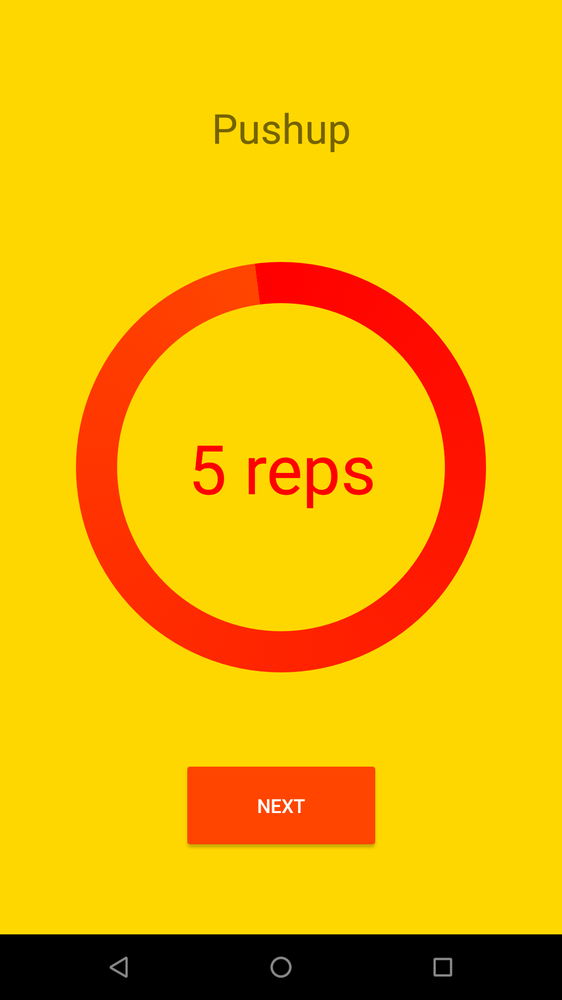
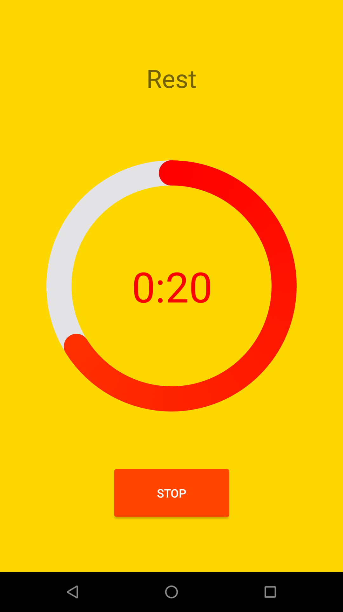
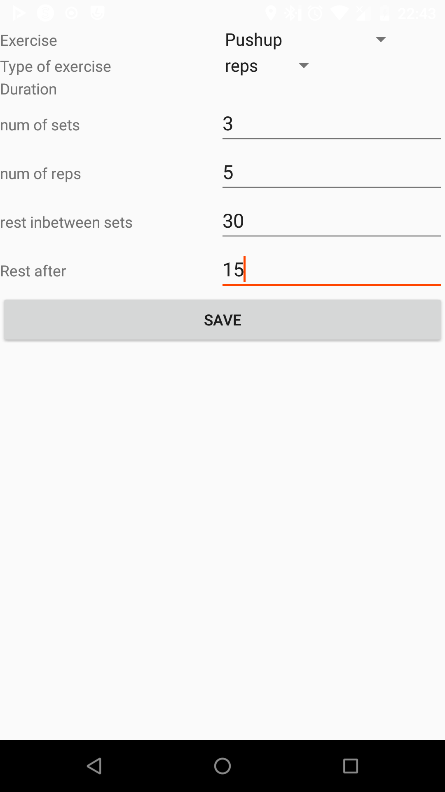

# Simplistic Workout Timer

*A workout app without any of the bells and whistles!*

  

Have you ever wished that having a workout was not so needlessly complicated? Well, now it is no longer a pipe dream! Whether you work out at home, or in a gym, this app will help you achieve the results you seek without distracting you! Simplistic Workout Timer is as it sounds. It is a simple app that lets you time your exercise routines without any of the fuss that comes in other apps. Just think up some exercises, make a workout and you're ready to go!

# Features
\*Built-in timer;

\*Customizable exercise and workout library;

\*Timed and repetition exercise options;

\*Simple, easy to use interface;

\*Open-source.

# Usage

Simply install the app, create new exercises, make a workout, and go wild! It's that easy!

# Requirements

Android SDK 26 (Android 8) or higher.

# License

The source code is licensed under GPLv3, except for CircleProgressBar license and Android assets.

### CircleProgressBar License
    Copyright 2015-2019 dinuscxj

    Licensed under the Apache License, Version 2.0 (the "License");
    you may not use this file except in compliance with the License.
    You may obtain a copy of the License at

       http://www.apache.org/licenses/LICENSE-2.0

    Unless required by applicable law or agreed to in writing, software
    distributed under the License is distributed on an "AS IS" BASIS,
    WITHOUT WARRANTIES OR CONDITIONS OF ANY KIND, either express or implied.
    See the License for the specific language governing permissions and
    limitations under the License.

